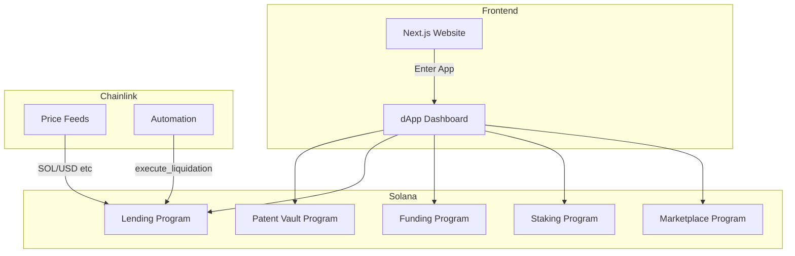

# NanoFi Architecture

## Overview

NanoFi is a scientific IP finance protocol on Solana with Chainlink integration for real-time valuation and automated liquidation.

## Block diagram

## Components

- **Patent Vault**: Registers IP metadata, mints Patent NFT (supply 1). PDA holds vault state; NFT used as collateral in Lending.
- **Lending**: Accepts patent NFT as collateral, issues loans in stable token. Reads Chainlink price feed for collateral valuation; exposes `execute_liquidation` for Chainlink Automation when LTV exceeds threshold.
- **Funding**: Campaigns with goal and milestones; contributions in SPL token; optional Chainlink verification for milestone triggers.
- **Staking**: Stake SPL token, earn rewards; pool tracks total staked and reward rate.
- **Marketplace**: List products linked to IP; buy flow transfers payment; revenue distribution (IP owner, stakers, contributors) as per README.

## Build and deploy

- **Contracts**: From `contracts/`, run `cargo build-sbf` (or `anchor build` if using full Anchor CLI). Deploy with `anchor deploy --provider.cluster devnet`.
- **Frontend**: From `frontend/`, run `npm install` then `npm run dev`. Set `NEXT_PUBLIC_SOLANA_RPC` for RPC endpoint (default: devnet).
- **Chainlink**: Use devnet feed addresses from [Chainlink Solana Feeds](https://docs.chain.link/data-feeds/price-feeds/addresses?network=solana). Configure Automation upkeep to call Lending `execute_liquidation` when LTV exceeds pool threshold.
